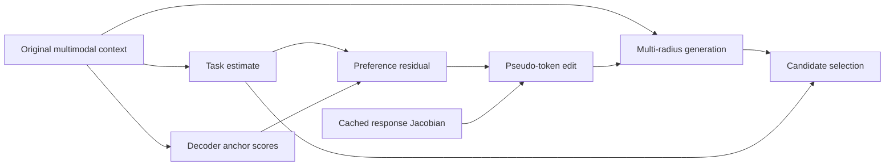

<h1 align="center">[MAPLE] Measurement-Aligned Pseudo-token Local Editing</h1>

## 📌 Abstract

Multimodal sentiment analysis with frozen language models requires converting contextual information into numerical answers through generation. A lightweight estimator can provide a continuous task estimate, but guiding the decoder toward that estimate requires an editing direction in embedding space and an editing magnitude that affects the generated output. We present Measurement-Aligned Pseudo-token Local Editing (MAPLE), a framework that edits the pseudo tokens produced by a frozen multimodal adapter. MAPLE expresses the task estimate as preferences over numerical response anchors and uses an offline average response Jacobian to map the preference residual into an editing direction. The decoder then generates candidates at multiple editing radii, and MAPLE selects a prediction by balancing agreement with the estimate and the edit norm. The original generation remains a candidate, while the adapter and language model remain frozen. This implementation supports Qwen-1.8B, ChatGLM3-6B-Base, and LLaMA2-7B on SIMS-V2 and CMU-MOSEI.

## 💡 Key Features

- **Measurement-aligned input editing.** MAPLE converts a point or distributional task estimate into decoder anchor preferences and edits only adapter-generated pseudo tokens. Final predictions come from the decoder's native generation interface.
- **Cached response gradients.** Label-free offline calibration produces a shared Jacobian. Editing uses its normalized transpose update, requiring neither matrix inversion nor a sample-specific backward pass at inference.
- **Generation-based candidate selection.** Multiple editing radii are evaluated through actual generation. An L2 edit penalty, an optional acceptance margin, and the original-output candidate control which edit is accepted.

## 🎇 Method Overview



## 🚀 Installation & Usage

### 1. Environment

Use Python 3.10–3.12 and a PyTorch build compatible with your hardware. From the repository root:

```bash
python -m venv .venv
source .venv/bin/activate
# Windows PowerShell: .venv\Scripts\Activate.ps1

# Install the appropriate CPU/CUDA PyTorch build first.
python -m pip install -r Requirements.txt
python -m pip install -e .
```

The editable installation registers the `maple` command. The MSE integration uses Transformers 4.36.1 and the upstream custom model wrappers.

### 2. Dataset and Checkpoint Preparation

Obtain the [MSE-Adapter](https://github.com/lishuaitong16/MSE-Adapter) source, pre-extracted dataset features, pretrained language model and tokenizer, and a matching trained adapter checkpoint. Use the upstream subproject corresponding to your backbone:

| Backbone | MSE-Adapter subproject | SIMS-V2 config | CMU-MOSEI config |
|---|---|---|---|
| Qwen-1.8B | `MSE-Qwen-1.8B` | `configs/qwen_simsv2.json` | `configs/qwen_mosei.json` |
| ChatGLM3-6B-Base | `MSE-ChatGLM3-6B` | `configs/chatglm3_simsv2.json` | `configs/chatglm3_mosei.json` |
| LLaMA2-7B | `MSE-Llama2-7B` | `configs/llama2_simsv2.json` | `configs/llama2_mosei.json` |

Dataset features must follow the selected upstream loader's format and directory layout. Pass their root through `--data-root`, the language-model directory through `--llm-path`, and the adapter checkpoint through `--adapter-checkpoint`. Keep model weights, tokenizer, prompts, and upstream source consistent across stages.

### 3. Quick Start

The following example runs Qwen on SIMS-V2. Replace the illustrative asset paths with your own, and use a new or empty output directory for each stage. Multiline commands use Bash syntax; in PowerShell, replace trailing backslashes with backticks or enter each command on one line.

**Calibrate response gradients using training inputs:**

```bash
maple calibrate --config configs/qwen_simsv2.json \
  --project-dir ../MSE-Adapter/MSE-Qwen-1.8B \
  --llm-path models/Qwen-1_8B --data-root datasets \
  --adapter-checkpoint checkpoints/seed-1111.pth \
  --samples 16 --seed 1111 --device cuda:0 \
  --output-dir runs/qwen_simsv2/1111/calibration
```

Calibration does not use sentiment labels. The sample count must be supplied explicitly through `--samples`.

**Train the task estimator:**

```bash
maple train-meter --config configs/qwen_simsv2.json \
  --project-dir ../MSE-Adapter/MSE-Qwen-1.8B \
  --llm-path models/Qwen-1_8B --data-root datasets \
  --adapter-checkpoint checkpoints/seed-1111.pth \
  --seed 1111 --device cuda:0 \
  --output-dir runs/qwen_simsv2/1111/estimator
```

Estimator training uses training labels and selects the saved checkpoint by validation MAE.

**Evaluate generated predictions:**

```bash
maple evaluate --config configs/qwen_simsv2.json \
  --project-dir ../MSE-Adapter/MSE-Qwen-1.8B \
  --llm-path models/Qwen-1_8B --data-root datasets \
  --adapter-checkpoint checkpoints/seed-1111.pth \
  --geometry runs/qwen_simsv2/1111/calibration/geometry.pt \
  --meter runs/qwen_simsv2/1111/estimator/meter.pt \
  --split valid --seed 1111 --device cuda:0 \
  --output-dir runs/qwen_simsv2/1111/valid
```

Use `--split test` after selecting settings on training and validation data. Before evaluating edits with a real backbone, check that its unedited predictions match the corresponding upstream pipeline.

### 4. Configuration

| Setting | Meaning |
|---|---|
| `radii` | Editing radii, beginning at zero and strictly increasing |
| `energy` | Weight of the L2 edit-norm penalty |
| `margin` | Minimum reduction in disagreement with the estimate required to accept an edit |
| `same_sign` | Restrict candidates to the finite original prediction's `value > 0` group |
| `target_width` | Fixed target width and lower bound on the effective Laplace scale |
| `adaptive_width` | Use the effective Laplace scale as the target width |

Qwen uses a readout-token estimator; ChatGLM and LLaMA use a Laplace estimator over cached hidden states. Qwen's `meter.batch_size` controls training input batches. For Laplace estimators, it controls cached-state training batches. `--input-batch-size` overrides the external input loader size. During editing, the estimate location is clipped to the anchor range, and the effective Laplace scale is used for candidate risk.

Qwen requires calibration geometry from the same adapter checkpoint and seed. The supplied ChatGLM/LLaMA profiles share geometry from seed `1111`, while each estimator must match the evaluated adapter and seed. To calibrate these adapters independently, set `calibration` to `{"reuse": "per_adapter_seed"}` and remove `source_seed`.

SIMS-V2 uses 21 anchors over `[-1,1]`; CMU-MOSEI uses 61 over `[-3,3]`. Qwen prefixes nonnegative anchor strings with `+`; the other profiles do not. Anchor scores sum numerical-token log-probabilities without EOS or length normalization.

## 📏 Evaluation & Outputs

Each evaluation reports the original decoder and MAPLE predictions using:

| Metric | Description |
|---|---|
| MAE ↓ | Mean absolute error on numerical predictions |
| Corr ↑ | Pearson correlation between predictions and labels |
| Acc5 ↑ | Five-class sentiment accuracy, stored as a fraction |
| Effective coverage | Fraction of samples whose selected value differs from the original prediction |

MAE and Corr use unclipped predictions. SIMS-V2 Acc5 clips to `[-1,1]` and uses thresholds `[-0.7,-0.1,0.1,0.7]`, with equality assigned to the lower interval. CMU-MOSEI Acc5 clips to `[-2,2]` and rounds to the nearest integer with ties to even. The upstream parser maps failed numerical conversions to `0.0`.

The example commands produce:

```text
runs/qwen_simsv2/1111/
├── calibration/
│   ├── geometry.pt
│   └── calibration.json
├── estimator/
│   ├── meter.pt
│   └── training.json
└── valid/
    ├── predictions.csv
    ├── predictions.pt
    └── metrics.json
```

Each stage also writes `manifest.json` with its configuration and asset identity. `predictions.pt` retains all candidates, edit norms, and selected actions; `predictions.csv` provides one row per sample.

## 🧪 Tests

Core and synthetic interface tests run on CPU without external datasets or language-model checkpoints:

```bash
python -m pip install -e ".[test]"
python -m pytest -q
```

## 🎈 Acknowledgments & License

This implementation builds on [MSE-Adapter](https://github.com/lishuaitong16/MSE-Adapter) and [PyTorch](https://pytorch.org/). We thank their authors and contributors.

The package metadata specifies the [MIT license](https://opensource.org/license/mit/). External models, datasets, and adapter code retain their respective licenses.
