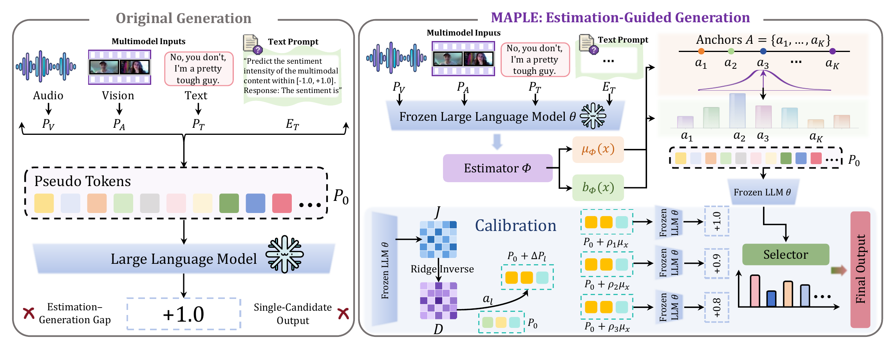

<h1 align="center">[MAPLE] Aligning Estimation and Generation for Multimodal Sentiment Analysis</h1>

## 📌 Abstract

Multimodal sentiment analysis (MSA) aims to infer human affect from complementary textual, acoustic, and visual cues. Recent approaches leverage large language models (LLMs) by mapping multimodal representations into continuous pseudo-token embeddings for sentiment prediction. However, fine-grained sentiment information recoverable from hidden representations may not be fully reflected in the numerical outputs generated by autoregressive decoding. We propose MAPLE, a lightweight framework that uses continuous sentiment estimates to guide pseudo-token refinement while keeping the adapter and LLM frozen. MAPLE represents the desired adjustment as a response residual over numerical anchors and uses a shared Jacobian to derive a normalized gradient editing direction. Multiple perturbation magnitudes are evaluated through greedy decoding, retaining the original prediction as a candidate and balancing agreement with the estimate against the perturbation norm. Extensive experiments support the effectiveness of using decoder responses to guide pseudo-token refinement and translate continuous sentiment estimates into more accurate generated predictions.

## 💡 Key Features

- We propose MAPLE, which connects continuous sentiment estimation with generation through local pseudo-token editing, keeping the adapter and LLM frozen.
- We derive editing directions from numerical anchor responses using a shared Jacobian calibrated offline, and select generated candidates across editing magnitudes by balancing task agreement and perturbation cost.
- Experiments on SIMS-V2 and MOSEI across multiple LLM backbones support the effectiveness of using decoder responses to guide pseudo-token edits that translate continuous sentiment estimates into improved generated predictions.

## 🎇 Method Overview

<p align="center">
  
</p>

## 🚀 Installation & Usage

### 1. Environment

```bash
python -m venv .venv
source .venv/bin/activate
# Windows PowerShell: .venv\Scripts\Activate.ps1

# Install the appropriate CPU/CUDA PyTorch build first.
python -m pip install -r Requirements.txt
python -m pip install -e .
```

### 2. Dataset and Checkpoint Preparation

Obtain the [MSE-Adapter](https://github.com/lishuaitong16/MSE-Adapter) source, pre-extracted dataset features, pretrained language model and tokenizer, and a matching trained adapter checkpoint. Use the upstream subproject corresponding to your backbone:

| Backbone | MSE-Adapter subproject | SIMS-V2 config | CMU-MOSEI config |
|---|---|---|---|
| Qwen-1.8B | `MSE-Qwen-1.8B` | `configs/qwen_simsv2.json` | `configs/qwen_mosei.json` |
| ChatGLM3-6B | `MSE-ChatGLM3-6B` | `configs/chatglm3_simsv2.json` | `configs/chatglm3_mosei.json` |
| LLaMA2-7B | `MSE-Llama2-7B` | `configs/llama2_simsv2.json` | `configs/llama2_mosei.json` |

Pass their root through `--data-root`, the language-model directory through `--llm-path`, and the adapter checkpoint through `--adapter-checkpoint`. Keep model weights, tokenizer, prompts, and upstream source consistent across stages.

### 3. Quick Start

The following example runs Qwen on SIMS-V2.

**Calibrate response gradients using training inputs:**

```bash
maple calibrate --config configs/qwen_simsv2.json \
  --project-dir ../MSE-Adapter/MSE-Qwen-1.8B \
  --llm-path models/Qwen-1_8B --data-root datasets \
  --adapter-checkpoint checkpoints/seed-1111.pth \
  --samples 16 --seed 1111 --device cuda:0 \
  --output-dir runs/qwen_simsv2/1111/calibration
```

**Train the task estimator:**

```bash
maple train-meter --config configs/qwen_simsv2.json \
  --project-dir ../MSE-Adapter/MSE-Qwen-1.8B \
  --llm-path models/Qwen-1_8B --data-root datasets \
  --adapter-checkpoint checkpoints/seed-1111.pth \
  --seed 1111 --device cuda:0 \
  --output-dir runs/qwen_simsv2/1111/estimator
```

**Evaluate generated predictions:**

```bash
maple evaluate --config configs/qwen_simsv2.json \
  --project-dir ../MSE-Adapter/MSE-Qwen-1.8B \
  --llm-path models/Qwen-1_8B --data-root datasets \
  --adapter-checkpoint checkpoints/seed-1111.pth \
  --geometry runs/qwen_simsv2/1111/calibration/geometry.pt \
  --meter runs/qwen_simsv2/1111/estimator/meter.pt \
  --split valid --seed 1111 --device cuda:0 \
  --output-dir runs/qwen_simsv2/1111/valid
```

## 📏 Evaluation & Outputs

| Metric | Description |
|---|---|
| MAE ↓ | Mean absolute error on numerical predictions |
| Corr ↑ | Pearson correlation between predictions and labels |
| Acc5 ↑ | Five-class sentiment accuracy, stored as a fraction |
| Effective coverage | Fraction of samples whose selected value differs from the original prediction |

The example commands produce:

```text
runs/qwen_simsv2/1111/
├── calibration/
│   ├── geometry.pt
│   └── calibration.json
├── estimator/
│   ├── meter.pt
│   └── training.json
└── valid/
    ├── predictions.csv
    ├── predictions.pt
    └── metrics.json
```

## 🧪 Tests

Core and synthetic interface tests run on CPU without external datasets or language-model checkpoints:

```bash
python -m pip install -e ".[test]"
python -m pytest -q
```

## 📢 LICENSE

The project is under [MIT License](./LICENSE), and is for research purpose ONLY.


## 🎈 **Acknowledgements**

Our implementation is built upon [MSE-Adapter](https://github.com/AZYoung233/MSE-Adapter). We thank the authors for their excellent work.
